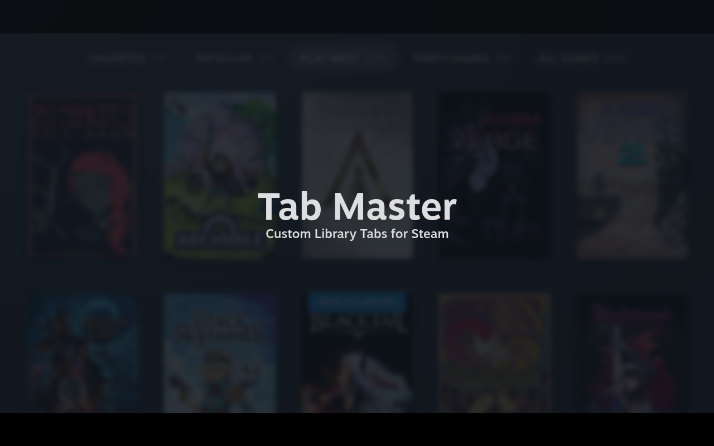

# Tab Master

A plugin for customizing, adding, and removing Library Tabs.

# Overview

TODO: overview

# Features

TODO: features

# Using the plugin
TODO: usage instructions

# Installation
1. [Install the Decky plugin loader](https://github.com/SteamDeckHomebrew/decky-loader#installation)
2. Use the built in plugin store to download the Tab Master Plugin